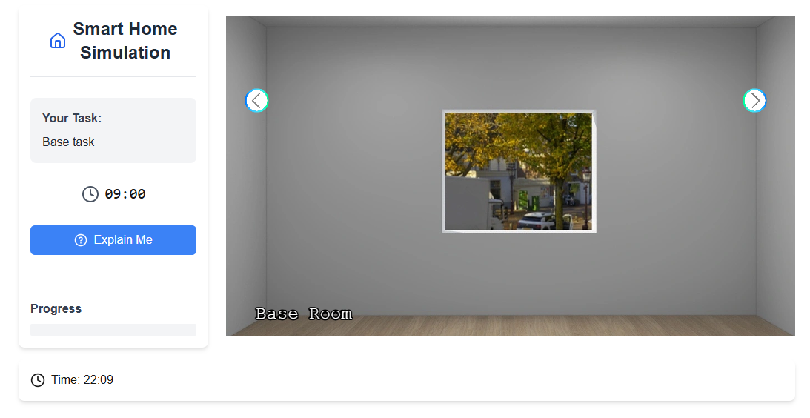
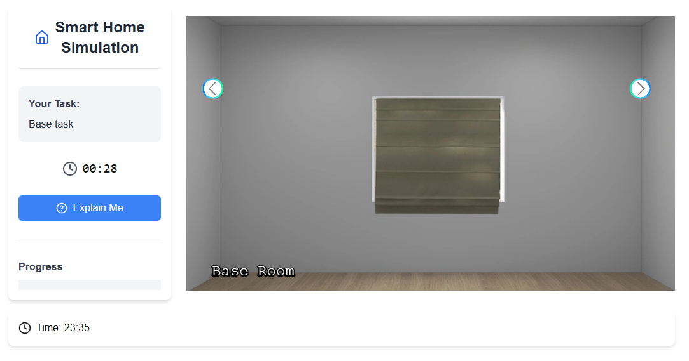

# Scenario 1

For the first scenario (Turn off heater), we first need to create pictures of the room with its elements
- Window
- Heater
- Thermostat

# Creating room and render 3D images

For that, we use Coohom, which is an interior designer tool that allows to render images of the room in 3D. Of course, there are alternatives, such as Planner 5D, Sweet Home 3D, ... .

In the floor mode, we first create the room by using a rectangle wall.
In addition, we create an Opening for the window


After, we go to the 3D view and click on the sidebar on 'Models'. 
There, we search for curtain and place it in front of the window. For the rendering later, it's recommended to hide the curtain for now.
For the heater, we search for heater and place it on another wall than the window wall. Similarly, we search for a tablet that acts as thermostat and place on the same wall.
The heater and tablet shall also be hidden for the rendering.

Additionally, other models can be placed onto the same or other wall.
Lastly, ceiling lamps can be placed so the brightness in the room remain high on the rendered images later.

Once we're done, we perform the rendering. For that, we go to 'Render' mode and generate a picture of each wall - note that the curtain, heater and tablet should be hidden during this phase. As a result, we get four pictures of each wall without the curtain, heater and tablet.

Now, switch back to 3D edit mode  and unhide the curtain, heater and tablet using the eye on the bottom and ticking the options.


Now, go back and make close-up pictures of the curtain, thermostat and heater so that we get three close-up images.


For now, the rendering is completed and we download the rendered images for further editing.

# Post-process renderings

For each close-up image, we remove the background by using [remove.bg](https://remove.bg) or the library [rembg](https://github.com/danielgatis/rembg). On the close-up device with removed background, we additionally crop the image to its content using GIMP, so that any excess transparent background is removed making the image smaller.

In addition, to the thermostat we modify the image so that the digital numbers '13' and '21' are shown.


# Set up the V-SHINE Study Platform

Since we are done creating the images, we can proceed to setting up the study platform. For that, we need to install some softwares prior - please follow https://git.cs.uni-koeln.de/shinelab/v-shine-study-platform/-/wikis/installation.

Once we're done installing the software, we can download the repository and go to the folder 'platform'.
There, we run the command `npm install` which installs the dependencies of the study platform.

After, we create in 'platform' the environment file `.env` with the following code:
```
MONGODB_URI=mongodb://localhost:27017/vshine_scenario1
MONGODB_DB=vshine_scenario1
```

This creates during runtime the database `vshine_scenario1` at the local MongoDB database.

Finally, we can start the development server with `npm run dev`. This opens a local server at `localhost:3000`.


Currently, we cannot proceed to the platform as it requires a base64-encoded JSON.
This can be easily done by passing an base64-encoded empty JSON (```{ }```) via the GET parameter `data`.
To create a such base64-decoded JSON, online tools such as https://www.base64encode.org/ can be used.


Thus, the final URL is `http://localhost:3000/?data=eyB9`.

There, we can proceed and view the prototype.

# Creating the first scneario within the study platform

To create the first scenario, we amend the game configuration file `platform\src\game.json`.

## Base configuration and walls

There, we define first the environment - the time.
```json
{
    "environment": {
        "time": {
            "startTime": {
                "hour": 8,
                "minute": 0
            },
            "speed": 10
        }
    }
}
```

We define here that the in-game time starts at 8 o' clock and every second in real-time correspond to 10 second in-game time.

Next, we define the room. Since we have only one room with four walls, the base will look like this
```json
{
   "rooms": [
        {
            "name": "Base Room",
            "walls": [
              {},
              {},
              {},
              {}
             ]
          }
   ]
}
```

For that we define the Object `rooms` with each object corresponding to a room. Within each object, we define the name of the room using `name` and another JSON object for the `walls` with each object corresponding to a wall.

For each of the wall, we define the path to the image of the wall. Furthermore, we set the `default` value of the first wall to `true` which shows the wall upon game start.

```json
{
    "rooms": [
        {
            "name": "Base Room",
            "walls": [
                {
                    "image": "assets/images/room/wall1/wall1.webp",
                    "default": true
                },
                {
                    "image": "assets/images/room/wall2/wall2.webp",
                    "default": false
                },
                {
                    "image": "assets/images/room/wall3/wall3.webp"
                },
                {
                    "image": "assets/images/room/wall4/wall4.webp"
                }
            ]
        }
    ]
}
```

The images of the wall are placed in the folder `platform\public\assets\images\room`

Further, we define a base task object and empty rules, as follow

```json
{
    "tasks": {
        "tasks": [
            {
                "id": "base_task",
                "description": "Base task",
                "timer": 600,
                "abortable": false,
                "environment": [
                ],
                "defaultDeviceProperties": [

                ],
                "goals": [
                   
                ]
            }
        ]
    }
}
```

In `tasks.tasks` object we define the base task with id `base_task`, description `Base task`, timer set to `600` seconds, `abortable` to `false` and empty `environment`, `defaultDeviceProperties` and `goals`.

The base task allows us to inspect the room during development.


Finally, we set an empty rules object as follow

```json
{
    "rules": [
    ]
}
```

So that the overall JSON looks like this
```json
{
    "environment": {
        "time": {
            "startTime": {
                "hour": 22,
                "minute": 0
            },
            "speed": 10
        }
    },
    "rules": [
    ],
    "tasks": {
        "tasks": [
            {
                "id": "base_task",
                "description": "Base task",
                "timer": 600,
                "abortable": false,
                "environment": [
                ],
                "defaultDeviceProperties": [

                ],
                "goals": [
                   
                ]
            }
        ]
    },
    "rooms": [
        {
            "name": "Base Room",
            "walls": [
                {
                    "image": "assets/images/room/wall1/wall1.webp",
                    "default": true
                },
                {
                    "image": "assets/images/room/wall2/wall2.webp",
                    "default": false
                },
                {
                    "image": "assets/images/room/wall3/wall3.webp"
                },
                {
                    "image": "assets/images/room/wall4/wall4.webp"
                }
            ]
        }
    ]
}
```

Now, we save the changes, restart the development server via `npm run dev` and visit http://localhost:3000/?data=eyB9

Now, we see the default wall and can switch between the walls using the controls above




Note that the room name says 'Base Room' which is derived from the room's configuration.

## Devices

Now, we can define the devices. We define devices via walls:
```json
{
   "image": "assets/images/room/wall1/wall1.webp",
   "default": true,
   "devices": [
   ]
}
```

There, we create the first device - curtain - as follow: 
```json
{
    "name": "Curtain",
    "id": "curtain",
    "position": {
        "x": 500,
        "y": 313,
        "scale": 1.5,
        "origin": 1
    },
    "interactions": [],
    "visualState": [
        {
            "default": true,
            "image": "assets/images/room/wall1/devices/curtain_closed.png"
        }
    ]
}
```

with `name` being 'Curtain', `id` being `curtain` or any other id following lowercase and underscores, the position as JSON object itself with `x` the x-position, `y` the y-position, `scale`, the scale parameter (controls if image should be larger/smaller) which defaults to 1 and the origin which follows Phaser and should be set to `1`.
For the position, it's recommended to set an initial position and adjust with multiple iterations to the correct place by saving the configuration file and refreshing the page - restarting the development serer is not needed.


After, we define an empty array of interactions, and an array of visual states with the default visual state - defined via `default` to `true`
```json
{
   "default": true,
   "image": "assets/images/room/wall1/devices/curtain_closed.png"
}
```

The visual states are responsible for showing different image states depending on interactions' values later.

Now, the curtain appears within the game.


Next, we define the interactions to open/close the curtain. For that we define an interaction of type `Boolean_Action`

```json
{
    "interactions": [
        {
            "InteractionType": "Boolean_Action",
            "name": "Closed",
            "inputData": {
                "valueType": ["PrimitiveType", "Boolean"],
                "unitOfMeasure": null,
                "type": {
                    "True": "Yes",
                    "False": "No"
                }
            },
            "currentState": {
                "visible": null,
                "value": true
            }
        }
    ]
}
```

There, we create an object with variables `InteractionType` to `Boolean_Action`, `name` to `Closed`, `inputData` with `valueType` always set to `["PrimitiveType", "Boolean"]`, `unitOfMeasure` to `null` and the boolean types to which the actual values correspond. Here, `True` defaults to `"Yes"` and `False` to `"No"`. Lastly, we set the `currentState` with `visible` to `null` (the interaction is never hidden - does not depend on any condition) and `value` to `true` (Closed is `Yes` per mapping).

This boolean interaction realizes a switch (True/False) in the panel later.

Since we created the interaction for open and closed curtain, we create another image for the open curtain which is a transparent image with the same size as closed curtain. We name the transparent image `curtain_open.png`. 
We can add `curtain_open.png` to the visual state as folllow:
```json
{
    "visualState": [
        {
            "default": true,
            "image": "assets/images/room/wall1/devices/curtain_closed.png"
        },
        {
            "image": "assets/images/room/wall1/devices/curtain_open.png",
            "conditions": [
                {
                    "name": "Closed",
                    "value": false
                }
            ]
        }
    ]
}
```

We keep the first image which is the default image when curtain is closed. This visual state applies if no other visual states apply.
Next, we create another object for opened curtain with the `conditions` array of the object that the interaction `Closed` value is false. If this case applies that the `Closed` value is false, then this visual states will be shown.

Another way of realising this is by creating two visual states with two opposed conditions - one with `Closed` to `true`, the other one with `Closed` to `false`.

Note that the visual states are evaluated and shown in the order they're listed in the array.

Hence, we are done and the curtain can be closed/opened within the game using the switch.
Note, to reload the development server via `npm run dev` and create a new session to see the changes apply.


After, we create the device heater with an boolean interaction `Power` in the same way as the curtain

```json
{
    "name": "Heater",
    "id": "heater",
    "position": {
        "x": 510,
        "y": 393,
        "scale": 0.5,
        "origin": 1
    },
    "interactions": [
        {
            "InteractionType": "Boolean_Action",
            "name": "Power",
            "inputData": {
                "valueType": [
                    "PrimitiveType",
                    "Boolean"
                ],
                "unitOfMeasure": null,
                "type": {
                    "True": "On",
                    "False": "Off"
                }
            },
            "currentState": {
                "visible": null,
                "value": true
            }
        }
    ],
    "visualState": [
        {
            "default": true,
            "image": "assets/images/room/wall2/devices/heater.png"
        }
    ]
}
```

Lastly, we create the thermostat with the numerical interaction `Temperature`

```json
{
    "name": "Thermostat",
    "id": "thermostat",
    "position": {
        "x": 280,
        "y": 270,
        "scale": 0.35,
        "origin": 1
    },
    "interactions": [
        {
            "InteractionType": "Numerical_Action",
            "name": "Temperature",
            "inputData": {
                "valueType": [
                    "PrimitiveType",
                    "Integer"
                ],
                "unitOfMeasure": "°C",
                "type": {
                    "Range": [
                        13,
                        21
                    ],
                    "Interval": [
                        8
                    ]
                }
            },
            "currentState": {
                "visible": false,
                "value": 13
            }
        }
    ],
    "visualState": [
        {
            "default": true,
            "image": "assets/images/room/wall2/devices/thermostat-13.png"
        },
        {
            "image": "assets/images/room/wall2/devices/thermostat-21.png",
            "conditions": [
                {
                    "name": "Temperature",
                    "value": 21
                }
            ]
        }
    ]
}
```

Unlike boolean interaction, the numerical interaction defines the range (here from 13 to 21) and the interval (here 8, difference between 13 and 21). Also, the `default` value is set to 13 and `visible` to false (the numerical slider is not shown). Note that `visible` can be `null`, `false` or accept an array of conditions when it's shown that depend on other interaction values. Here, `unitOfMeasure` can be set to `°C` which is appended to the value.

Besides, we add the visual state for 13 and 21. where the latter one depends on the condition whether the temperatue equals 21.

That's the final result after reloading the development server and starting a new session.


Since we are done creating the devices, we can proceed to creating the rules

## Rules

For the scenario, we have two rules
- If the user tries to turn off the heater, set it back to 'On' when the 'Curtain' is not closed (= window open)
- If the user closes the curtain (= window closed), the temperature on the thermostat changes to 21.

To implement these rules, we define two JSON objects within the rules array as follow:

**Keep heater on if thermostat is below 20**

```json
{
    "id": "heater_temperature",
    "name": "Heater on when the thermostat is below 20",
    "precondition": [
        {
            "type": "Device",
            "device": "curtain",
            "condition": {
                "name": "Closed",
                "operator": "==",
                "value": false
            }
        },
        {
            "type": "Device",
            "device": "thermostat",
            "condition": {
                "name": "Temperature",
                "operator": "<=",
                "value": 20
            }
        }
    ],
    "action": [
        {
            "type": "Device_Interaction",
            "device": "heater",
            "interaction": {
                "name": "Power",
                "value": true
            }
        }
    ]
}
```

Here, we define the ID, description, the preconditions which can be based on Device variables (through device id and interaction id), time or context (environment variables, task or user variables of base64 encoded JSON). If all preconditions apply (using `AND`), then the action(s) will be triggered.
An action can be a device interaction or issue an explanation (if using integrated explanation engine - see later).

**Increase temperature on thermostat if curtain is closed**

```json
{
    "id": "curtain_thermostat",
    "name": "Heater on when the curtain is open",
    "precondition": [
        {
            "type": "Device",
            "device": "curtain",
            "condition": {
                "name": "Closed",
                "operator": "==",
                "value": true
            }
        }
    ],
    "action": [
        {
            "type": "Device_Interaction",
            "device": "thermostat",
            "interaction": {
                "name": "Temperature",
                "value": 21
            }
        }
    ]
}
```

In this rule, we define that the temperature of the thermostat increases to 21 if the curtain gets closed (= window closed).

Since we're done creating the rules, we can proceed with the explanation engine.

## Explanation Engine

### Clarification of Explanation Engine Configuration

For the explanation engine, we use the file `explanation.json` which is in the same directory as `game.json`.
Here, we define what kind of explanation engine we use (either `integrated` or `external`), whether explanations are shown automatic or on-demand, which kind of communication for the external explanation engine (either `rest` or `websocket`) as well as the API for the REST/Websocket Explanation Engine.

If we would use the integrated explanation engine, we can define in the `integrated_explanation_engine` object the keys (IDs) and values (explanations). The keys are used in the action of the rules.

Further, we can enable the rating of explanation via `explanation_rating` by setting to `"like"` that shows thumbs up/thumbs down button to the explanation.

Finally, we can allow to pass messages to explanation engine which works only with `explanation_engine` set to `true`, `external_engine_type` set to `"rest"` and `explanation_trigger` set to `"on_demand"` setting, by setting `allow_user_message` to `true`.

### Scenario Explanation Engine

For this scenario, we use an external explanation engine, communicated via REST, since we want to pass user messages to the explanaion engine, such as questions. Using the question, we create a simple explanation engine based on a LLM.

Therefore, our explanation.json is configured that way

```json
{
    "explanation_trigger": "on_demand",
    "explanation_engine": "external",
    "external_engine_type": "rest", 
    "external_explanation_engine_api": "http://127.0.0.1:5001/engine",
    "allow_user_message": true
}
```

## Task

Finally, we need to amend the base task. For that, we update the `id` to `heater_off`, the `description` to `Turn off the heater`.
Next, we can set the environment variables which are shown below the game in a bar but is optional. For information-purpose, it should be shown that the outdoor temperature is 10 °C. Thus, the environment is
```json
{
    "environment": [
        { "name": "Outdoor Temperature", "value": "10 °C" }
    ]
}
```


Next, we set the default device properties which is also optional in our case since we have only one base task. Setting the default device properties is useful in setttings when the user may have interacted with a device before (in a previous task) and that conflicts with future task's goals.
In our scenario, the heater should be turned on, the temperature set to 13 and the curtain is opened (Closed = false). Therefore, we define these properties as follow
```json
{
    "defaultDeviceProperties": [
        {
            "device": "heater",
            "properties": [
                {
                    "name": "Power",
                    "value": true
                }
            ]
        },
        {
            "device": "thermostat",
            "properties": [
                {
                    "name": "Temperature",
                    "value": 13
                }
            ]
        },
        {
            "device": "curtain",
            "properties": [
                {
                    "name": "Closed",
                    "value": false
                }
            ]
        }
    ]
}
```

For the device, we use the device ID and set the properties in an array. These values override the properties upon task start.

Finally, we define the task goal which is to turn off the heater. This is defined as follow
```json
{
    "goals": [
        {
            "device": "heater",
            "condition": {
                "name": "Power",
                "operator": "==",
                "value": false
            }
        }
    ]
}
```

Here, we use the device ID again and the condition with the property and operator that needs to be fulfilled to finish the task and so the game. Note, that we can define multiple task goals of which all conditions must be satisfied.

## Game / Explanation JSON

Since we're done creating the scenario, we can restart the development server via `npm run dev` and create a new session via http://localhost:3000/?data=eyB9.

Furthermore, the full game JSON and explanation is as follow:

**game.json**
```json
{
    "environment": {
        "time": {
            "startTime": {
                "hour": 8,
                "minute": 0
            },
            "speed": 10
        }
    },
    "rules": [
        {
            "id": "heater_temperature",
            "name": "Heater on when the thermostat is below 20",
            "precondition": [
                {
                    "type": "Device",
                    "device": "curtain",
                    "condition": {
                        "name": "Closed",
                        "operator": "==",
                        "value": false
                    }
                },
                {
                    "type": "Device",
                    "device": "thermostat",
                    "condition": {
                        "name": "Temperature",
                        "operator": "<=",
                        "value": 20
                    }
                }
            ],
            "action": [
                {
                    "type": "Device_Interaction",
                    "device": "heater",
                    "interaction": {
                        "name": "Power",
                        "value": true
                    }
                }
            ]
        },
        {
            "id": "curtain_thermostat",
            "name": "Heater on when the curtain is open",
            "precondition": [
                {
                    "type": "Device",
                    "device": "curtain",
                    "condition": {
                        "name": "Closed",
                        "operator": "==",
                        "value": true
                    }
                }
            ],
            "action": [
                {
                    "type": "Device_Interaction",
                    "device": "thermostat",
                    "interaction": {
                        "name": "Temperature",
                        "value": 21
                    }
                }
            ]
        }
    ],
    "tasks": {
        "tasks": [
            {
                "id": "heater_off",
                "description": "Turn off the heater",
                "timer": 600,
                "abortable": false,
                "environment": [
                    { "name": "Outdoor Temperature", "value": "10 °C" }
                ],
                "defaultDeviceProperties": [
                    {
                        "device": "heater",
                        "properties": [
                            { "name": "Power", "value": true }
                        ]
                    },
                    {
                        "device": "thermostat",
                        "properties": [
                            { "name": "Temperature", "value": 13 }
                        ]
                    },
                    {
                        "device": "curtain",
                        "properties": [
                            { "name": "Closed", "value": false}
                        ]
                    }
                ],
                "goals": [
                    {
                        "device": "heater",
                        "condition": {
                            "name": "Power",
                            "operator": "==",
                            "value": false
                        }
                    }
                ]
            }
        ]
    },
    "rooms": [
        {
            "name": "Base Room",
            "walls": [
                {
                    "image": "assets/images/room/wall1/wall1.webp",
                    "default": true,
                    "devices": [
                        {
                            "name": "Curtain",
                            "id": "curtain",
                            "position": {
                                "x": 500,
                                "y": 313,
                                "scale": 1.5,
                                "origin": 1
                            },
                            "interactions": [
                                {
                                    "InteractionType": "Boolean_Action",
                                    "name": "Closed",
                                    "inputData": {
                                        "valueType": ["PrimitiveType", "Boolean"],
                                        "unitOfMeasure": null,
                                        "type": {
                                            "True": "Yes",
                                            "False": "No"
                                        }
                                    },
                                    "currentState": {
                                        "visible": null,
                                        "value": false
                                    }
                                }
                            ],
                            "visualState": [
                                { "default": true, "image": "assets/images/room/wall1/devices/curtain_closed.png" },
                                {
                                    "image": "assets/images/room/wall1/devices/curtain_open.png",
                                    "conditions": [
                                        {
                                            "name": "Closed", "value": false
                                        }
                                    ]
                                }
                            ]
                        }
                    ]
                },
                {
                    "image": "assets/images/room/wall2/wall2.webp",
                    "default": false,
                    "devices": [
                        {
                            "name": "Heater",
                            "id": "heater",
                            "position": {
                                "x": 510,
                                "y": 393,
                                "scale": 0.5,
                                "origin": 1
                            },
                            "interactions": [
                                {
                                    "InteractionType": "Boolean_Action",
                                    "name": "Power",
                                    "inputData": {
                                        "valueType": ["PrimitiveType", "Boolean"],
                                        "unitOfMeasure": null,
                                        "type": {
                                            "True": "On",
                                            "False": "Off"
                                        }
                                    },
                                    "currentState": {
                                        "visible": null,
                                        "value": true
                                    }
                                }
                            ],
                            "visualState": [
                                { "default": true, "image": "assets/images/room/wall2/devices/heater.png" }
                            ]
                        },
                        {
                            "name": "Thermostat",
                            "id": "thermostat",
                            "position": {
                                "x": 280,
                                "y": 270,
                                "scale": 0.35,
                                "origin": 1
                            },
                            "interactions": [
                                                                {
                                    "InteractionType": "Numerical_Action",
                                    "name": "Temperature",
                                    "inputData": {
                                        "valueType": ["PrimitiveType", "Integer"],
                                        "unitOfMeasure": "°C",
                                        "type": {
                                            "Range": [13,21],
                                            "Interval": [8]
                                        }
                                    },
                                    "currentState": {
                                        "visible": false,
                                        "value": 13
                                    }
                                }
                            ],
                            "visualState": [
                                { "default": true, "image": "assets/images/room/wall2/devices/thermostat-13.png" },
                                {
                                    "image": "assets/images/room/wall2/devices/thermostat-21.png",
                                    "conditions": [
                                        { 
                                            "name": "Temperature",
                                            "value": 21
                                        }
                                    ]
                                }
                            ]
                        }
                    ]
                },
                {
                    "image": "assets/images/room/wall3/wall3.webp"
                },
                {
                    "image": "assets/images/room/wall4/wall4.webp"
                }
            ]
        }
    ]
}
```

and

**explanation.json**

```json
{
    "explanation_trigger": "on_demand",
    "explanation_engine": "external",
    "external_engine_type": "rest", 
    "external_explanation_engine_api": "http://127.0.0.1:5001/engine",
    "allow_user_message": true
}
```

## Final Result


