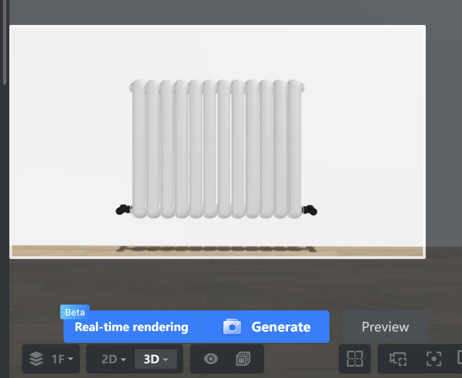

# CIRCE Scenario 
## Introduction

To demonstrate the practical application and utility of our framework, we present an illustrative case study that also serves as 
a step-by-step guide for its implementation.

To ensure neutrality and demonstrate the generalizability of our system, we deliberately chose a scenario from a published 
research study unrelated to our own group or work. We conducted a keyword search on Google Scholar to identify various research 
efforts focused on explanation systems in smart home environments. We reviewed their implementations and evaluations to assess 
whether our framework could help the authors more effectively evaluate and understand their systems’ behavior, specifically by 
allowing them to simulate their system in a way that real end-users can interact with it.

From the pool of relevant studies, we selected the following scenario as an example. 
It is used in this documentation both to demonstrate the feasibility of our framework and to provide a practical, 
walk-through example of how to configure and run a scenario using our system.

 
We selected the study:
> **“CIRCE: a Scalable Methodology for Causal Explanations in Cyber-Physical Systems”**, published at the
> _IEEE International Conference on Autonomic Computing and Self-Organizing Systems (ACSOS), 2024._
> [DOI: 10.1109/ACSOS61780.2024.00026](https://doi.org/10.1109/ACSOS61780.2024.00026)
  

> **Abstract Summary**:
> CIRCE proposes a scalable method to generate contextual, interpretable, and reactive causal explanations in cyber-physical systems such as smart homes. It determines the cause of a user-questioned fact at runtime using a local abduction technique and LIME-based approximation. CIRCE was validated via **simulated smart home scenarios**, but **no user study** was performed to evaluate the effectiveness or usability of the generated explanations.

The original study evaluated its methodology by simulating a smart home to generate causal explanations, 
focusing on system-centric metrics like performance and the accuracy of the explanation versus an expected outcome. 
However, this evaluation did not involve end-users to assess the human-centric aspects of the explanations, such as 
their effectiveness, clarity, or how well they were understood. 

This presents an ideal use case for our framework, demonstrating its capability to bridge the gap between technical validation and essential user-centered evaluation.

## Adapting CIRCE’s Example Scenarios in V-SHiNE
In the CIRCE paper, four distinct explanatory situations are described. Each involves a user asking for the cause of a system behavior (e.g., why a device is on, why a temperature is low, etc.), and CIRCE provides causally sound answers.

**Situation 1 — Recreated in V-SHiNE**
-   **User Task**: _Turn off the Heater_  
-   **System Behavior**: The heater cannot be turned off due to environmental constraints.   
-   **Triggering Explanations**: The user initiates on-demand questions to understand the situation.
 
**Interaction Flow:**
1.  The user tries to **turn off the heater** but **cannot**.  
2.  The user clicks the explanation button and asks:    
    → _“Why can’t I turn off the heater?”_   
3.  The system returns:   
    → "The indoor temperature is lower than 15°C"   
4.  The user then asks:   
    → _“Why is the temperature below 15°C?”_  
5.  The system returns: 
    → "The window is open and the outside temperature is lower than 15°C"   
6.  The user may choose to abort the task.


## Step 1- Room Creation and 3D Rendering
###  1.1- Build the Room
To visually simulate the smart environment, we create a 3D model of the room using [Coohom](https://www.coohom.com/), an free interior design tool that supports realistic rendering. Alternative tools such as Planner 5D or Sweet Home 3D may also be used, but the following walkthrough is based on Coohom.

In floor mode, we first create the room using rectangular walls.
Additionally, we create an opening for the window


Next, we go to the 3D view and click on the sidebar on 'Models'. 
There, we search for window and place it in the opening. For later rendering, it's recommended to hide the window for now.
For the heater, we search for heater and place it on another wall than the window wall. Similarly, we search for a tablet that acts as thermostat and place on the same wall.
The heater and tablet should also be hidden for the rendering.

Additionally, other models can be placed on the same or other walls.
Lastly, ceiling lamps can be placed so the brightness in the room remains high on the rendered images later.

Once we're finished, we perform the rendering. For that, we go to 'Render' mode and generate a picture of each wall - note that the window, heater and tablet should be hidden during this phase. As a result, we get four pictures, one of each wall without the window, heater and tablet.

Now, switch back to 3D edit mode and unhide the window, heater and tablet using the eye on the bottom and ticking the options.


###  1.2- Generate Rendered Images

Now, go back and make close-up pictures of the window, thermostat and heater so that we get three close-up images.



For now, the rendering is completed and we download the rendered images for further editing.

:::info
The wall images should have a size of 1024x576 pixel. When rendering with Coohom, you can choose the size.

For other tools, please consider resizing the images.
:::

###  1.3-Post-process renderings

For each close-up image, we remove the background by using [remove.bg](https://remove.bg) or the library [rembg](https://github.com/danielgatis/rembg). On the close-up device with removed background, we additionally crop the image to its content using GIMP, so that any excess transparent background is removed making the image smaller.

In addition, to the thermostat we modify the image so that the digital numbers '13' and '21' are shown.


## Step 2- Set up the V-SHiNE Study Platform

Since we have finished creating the images, we can proceed to set up the study platform. For that, we need to install some softwares prior - please follow the [installation](../installation.mdx).

Once we're done installing the software, we can download the repository and go to the folder 'platform'.
There, we run the command `npm install` which installs the dependencies of the study platform.

After, we create in 'platform' the environment file `.env` with the following code:
```
MONGODB_URI=mongodb://localhost:27017/vshine_scenario1
MONGODB_DB=vshine_scenario1
```

This creates during runtime the database `vshine_scenario1` at the local MongoDB database.

Finally, we can start the development server with `npm run dev`. This opens a local server at `localhost:3000`.


Currently, we cannot proceed to the platform as it requires a base64-encoded JSON.
This can be easily done by passing an base64-encoded empty JSON (```{ }```) via the GET parameter `data`.
To create a such base64-decoded JSON, online tools such as https://www.base64encode.org/ can be used.


Thus, the final URL is `http://localhost:3000/?data=eyB9`.

There, we can proceed to view the prototype.

## Step 3- Configuring the Game Schema

We begin by configuring the main simulation setup in 'platform/src/game.json' (See [Game Config Schema](../game-config/game_schema)).

###  3.1- Environment and Walls configuration 

We first define the simulation time using the environment object:

```json
{
    "environment": {
        "time": {
            "startTime": {
                "hour": 8,
                "minute": 0
            },
            "speed": 10
        }
    }
}
```

This defines that the in-game time starts at **08:00**, and each second of real time corresponds to **10 seconds** of in-game time.
See [Environment](../game-config/game_schema/environment) for more info.

**Rooms configuration**

Next, we define the **room and its walls**. In this example, we use one room with four walls:
```json
{
   "rooms": [
        {
            "name": "Base Room",
            "walls": [
              {},
              {},
              {},
              {}
             ]
          }
   ]
}
```

For this, we define the `rooms` object with each object corresponding to a room. Within each object, we define the room name using `name` and an array of `walls` with each object corresponding to a wall.

We then provide wall images and designate the first wall as the default visible wall:
```json
{
    "rooms": [
        {
            "name": "Base Room",
            "walls": [
                {
                    "image": "assets/images/room/wall1/wall1.webp",
                    "default": true
                },
                {
                    "image": "assets/images/room/wall2/wall2.webp",
                    "default": false
                },
                {
                    "image": "assets/images/room/wall3/wall3.webp"
                },
                {
                    "image": "assets/images/room/wall4/wall4.webp"
                }
            ]
        }
    ]
}
```
Wall images must be stored in: 'platform/public/assets/images/room/'.

See [Walls](../game-config/game_schema/walls) for more info.

###  3.2- Run the development Server with empty objects and place holders

#### Base Task and Rules
Further, we define a base task object and empty rules, as follow. It allows us to explore the environment during development:

```json
{
    "tasks": {
        "tasks": [
            {
                "id": "base_task",
                "description": "Base task",
                "timer": 600,
                "abortable": false,
                "environment": [
                ],
                "defaultDeviceProperties": [

                ],
                "goals": [
                   
                ]
            }
        ]
    }
}
```

In `tasks.tasks` object we define the base task with id `base_task`, description `Base task`, timer set to `600` seconds, `abortable` to `false` and empty `environment`, `defaultDeviceProperties` and `goals`.

Finally, we set an empty rules object as follow

```json
{
    "rules": [
    ]
}
```
#### Putting It All Together 
Here’s the full base game.json configuration, so far:
```json
{
    "environment": {
        "time": {
            "startTime": {
                "hour": 22,
                "minute": 0
            },
            "speed": 10
        }
    },
    "rules": [
    ],
    "tasks": {
        "tasks": [
            {
                "id": "base_task",
                "description": "Base task",
                "timer": 600,
                "abortable": false,
                "environment": [
                ],
                "defaultDeviceProperties": [

                ],
                "goals": [
                   
                ]
            }
        ]
    },
    "rooms": [
        {
            "name": "Base Room",
            "walls": [
                {
                    "image": "assets/images/room/wall1/wall1.webp",
                    "default": true
                },
                {
                    "image": "assets/images/room/wall2/wall2.webp",
                    "default": false
                },
                {
                    "image": "assets/images/room/wall3/wall3.webp"
                },
                {
                    "image": "assets/images/room/wall4/wall4.webp"
                }
            ]
        }
    ]
}
```

####  Run the development Server
Once saved, restart the development server `npm run dev` and visit http://localhost:3000/?data=eyB9

You will see the default wall and can switch views using the controls above. The room is named “Base Room” as defined.


### 3.3- Devices Configuration

Each device is defined inside the corresponding wall object:

```json
{
   "image": "assets/images/room/wall1/wall1.webp",
   "default": true,
   "devices": [
   ]
}
```
You can find full description of Device schema at [Device](../game-config/game_schema/devices).

Let’s add the following devices:

#### 🪟 Window
We create the first device - window - as follow: 
```json
{
    "name": "Window",
    "id": "window",
    "position": {
        "x": 500,
        "y": 313,
        "scale": 1.5,
        "origin": 1
    },
    "interactions": [],
    "visualState": [
        {
            "default": true,
            "image": "assets/images/room/wall1/devices/window_closed.png"
        }
    ]
}
```

with `name` being 'Window', `id` being `window` or any other id following lowercase and underscores, the position as JSON object itself with `x` the x-position, `y` the y-position, `scale`, the scale parameter (controls if image should be larger/smaller) which defaults to 1 and the origin which follows Phaser and should be set to `1`.
For the position, it's recommended to set an initial position and adjust with multiple iterations to the correct place by saving the configuration file and refreshing the page - restarting the development serer is not needed.

##### Creating the Interactions and Visual States (See [Interacting With devices](../game-config/game_schema/interaction_types))

Then, we define an empty array of interactions, and an array of visual states with the default visual state - defined via `default` to `true`
```json
{
   "default": true,
   "image": "assets/images/room/wall1/devices/window_closed.png"
}
```

The visual states are responsible for showing different image states depending on interactions' values later.

Now, the window appears within the game.


Next, we define the interactions to open/close the window. For that we define an interaction of type `Boolean_Action`

```json
{
    "interactions": [
        {
            "InteractionType": "Boolean_Action",
            "name": "Open",
            "inputData": {
                "valueType": ["PrimitiveType", "Boolean"],
                "unitOfMeasure": null,
                "type": {
                    "True": "Yes",
                    "False": "No"
                }
            },
            "currentState": {
                "visible": null,
                "value": true
            }
        }
    ]
}
```

There, we create an object with variables `InteractionType` to `Boolean_Action`, `name` to `Open`, `inputData` with `valueType` always set to `["PrimitiveType", "Boolean"]`, `unitOfMeasure` to `null` and the boolean types to which the actual values correspond. Here, `True` defaults to `"Yes"` and `False` to `"No"`. Lastly, we set the `currentState` with `visible` to `null` (the interaction is never hidden - does not depend on any condition) and `value` to `true` (Open is `Yes` per mapping).

This boolean interaction realizes a switch (True/False) in the panel later.

Since we created the interaction for open and closed window, we create another image for the open window which is a transparent image with the same size as closed window. We name the transparent image `window_open.png`. 
We can add `window_open.png` to the visual state as folllow:
```json
{
    "visualState": [
        {
            "default": true,
            "image": "assets/images/room/wall1/devices/window_closed.png"
        },
        {
            "image": "assets/images/room/wall1/devices/window_open.png",
            "conditions": [
                {
                    "name": "Open",
                    "value": true
                }
            ]
        }
    ]
}
```

We keep the first image which is the default image when window is closed. This visual state applies if no other visual states apply.
Next, we create another object for opened window with the `conditions` array of the object that the interaction `Open` value is true. If this case applies that the `Open` value is true, then this visual states will be shown.

Another way of realising this is by creating two visual states with two opposed conditions - one with `Open` to `false`, the other one with `Open` to `true`.

Note that the visual states are evaluated and shown in the order they're listed in the array from top to bottom.

Hence, we are done and the window can be closed/opened within the game using the switch.
Note, to reload the development server via `npm run dev` and create a new session to see the changes apply.


#### 🔥 Heater (with Boolean Interaction)

Next, we create the heater device with an boolean interaction `Power` in the same way as the window

```json
{
    "name": "Heater",
    "id": "heater",
    "position": {
        "x": 510,
        "y": 393,
        "scale": 0.5,
        "origin": 1
    },
    "interactions": [
        {
            "InteractionType": "Boolean_Action",
            "name": "Power",
            "inputData": {
                "valueType": [
                    "PrimitiveType",
                    "Boolean"
                ],
                "unitOfMeasure": null,
                "type": {
                    "True": "On",
                    "False": "Off"
                }
            },
            "currentState": {
                "visible": null,
                "value": true
            }
        }
    ],
    "visualState": [
        {
            "default": true,
            "image": "assets/images/room/wall2/devices/heater.png"
        }
    ]
}
```

#### 🌡️ Thermostat (with    §Numerical Interaction)
Lastly, we create the thermostat with the numerical interaction `Temperature`

```json
{
    "name": "Thermostat",
    "id": "thermostat",
    "position": {
        "x": 280,
        "y": 270,
        "scale": 0.35,
        "origin": 1
    },
    "interactions": [
        {
            "InteractionType": "Numerical_Action",
            "name": "Temperature",
            "inputData": {
                "valueType": [
                    "PrimitiveType",
                    "Integer"
                ],
                "unitOfMeasure": "°C",
                "type": {
                    "Range": [
                        13,
                        21
                    ],
                    "Interval": [
                        8
                    ]
                }
            },
            "currentState": {
                "visible": false,
                "value": 13
            }
        }
    ],
    "visualState": [
        {
            "default": true,
            "image": "assets/images/room/wall2/devices/thermostat-13.png"
        },
        {
            "image": "assets/images/room/wall2/devices/thermostat-21.png",
            "conditions": [
                {
                    "name": "Temperature",
                    "value": 21
                }
            ]
        }
    ]
}
```

Unlike boolean interactions, numerical interactions define the range (here from 13 to 21) and the interval (here 8, difference between 13 and 21). Also, the `default` value is set to 13 and `visible` to false (the numerical slider is not shown). Note that `visible` can be `null`, `false` or accept an array of conditions when it's shown that depend on other interaction values. Here, `unitOfMeasure` can be set to `°C`, which is appended to the value.

Besides, we add the visual state for 13 and 21. where the latter one depends on the condition whether the temperatue equals 21.

That's the final result after reloading the development server and starting a new session.


### 3.4- Rules Configuration

For the scenario, we have two rules
- **Rule 1**: Keep Heater On if Window is Open and Temp < 20°C
- **Rule 2**: Raise Temperature to 21°C When Window is Closed

To implement these rules, we define two JSON objects within the rules array as follow:

**Rule 1**

```json
{
    "id": "heater_temperature",
    "name": "Heater on when the thermostat is below 20",
    "precondition": [
        {
            "type": "Device",
            "device": "window",
            "condition": {
                "name": "Open",
                "operator": "==",
                "value": true
            }
        },
        {
            "type": "Device",
            "device": "thermostat",
            "condition": {
                "name": "Temperature",
                "operator": "<=",
                "value": 20
            }
        }
    ],
    "action": [
        {
            "type": "Device_Interaction",
            "device": "heater",
            "interaction": {
                "name": "Power",
                "value": true
            }
        }
    ]
}
```

Here, we define the ID, description, and preconditions which can be based on Device variables (through device id and interaction id), time or context (environment variables, task or user variables of base64 encoded JSON). 
If all preconditions apply (using `AND`), then the action(s) will be triggered.
An action can be a device interaction or can issue an explanation (if using integrated explanation engine - see later).
See [Rules](../game-config/game_schema/rules)for more detailed description.

**Rule 2**

```json
{
    "id": "window_thermostat",
    "name": "Heater on when the window is open",
    "precondition": [
        {
            "type": "Device",
            "device": "window",
            "condition": {
                "name": "Open",
                "operator": "==",
                "value": false
            }
        }
    ],
    "action": [
        {
            "type": "Device_Interaction",
            "device": "thermostat",
            "interaction": {
                "name": "Temperature",
                "value": 21
            }
        }
    ]
}
```

In this rule, we define that the temperature of the thermostat increases to 21 if the window gets closed (Open = false).

## Step 4- Configuring the Explanation Engine Schema

To simulate the explanations described in the CIRCE study, we configure an explanation engine within our platform. The engine is configured 
via the 'explanation.json' file, located in the same directory as 'game.json'. For a full description of the explanation configuration schema, see [Explanation Schema Documentation](../game-config/explanation_engine).

For the **CIRCE scenario**, it is important to note that our implementation is intended as a demonstration and showcase rather than a full reproduction of the original CIRCE explanation engine.
  
Accordingly, we implemented a lightweight external explanation engine, powered by an LLM, that mimics the core behavior of CIRCE by returning predefined causal explanations. The responses are based on the **expected explanations reported in the original paper** during their evaluation.


This approach allows us to simulate realistic user-system interactions without re-implementing CIRCE’s internal mechanics. Instead, we focus on showcasing how such explanations could be integrated into an interactive, explainable smart home simulation environment.
  

> 💡 **In a real use case**, for instance if the authors of the CIRCE paper (or any other researchers) wish to adapt our framework, they would simply need to configure the framework to communicate with their own REST or WebSocket API that generates explanations using their implementation. No changes to the simulation platform would be required beyond the explanation.json configuration.


Therefore, our explanation.json is configured as following

```json
{
    "explanation_trigger": "pull",
    "explanation_engine": "external",
    "external_explanation_engine": {
        "external_engine_type": "rest",
        "external_explanation_engine_api": "http://127.0.0.1:5001/engine"
    },
}
```
> The REST API at http://127.0.0.1:5001/engine should be implemented separately. It receives user input and returns an explanation as a JSON response.

## Step 5- Task

To complete the scenario, we configure a user task that defines the goal of the simulation, the initial device state, and any contextual information displayed to the user.

We modify the existing base task and replace it with a task where the users turn off the heater, mirroring Situation 1 in the CIRCE paper. We begin by updating the basic task information:
```json
{
  "id": "heater_off",
  "description": "Turn off the heater"
}
```
**Environment Variables (Optional)**

We can optionally define environment variables to provide additional contextual information to the user during the task. These variables are displayed in a status bar at the bottom of the screen and are intended solely for informational purposes.

For this scenario, we define a single environment variable indicating that the outdoor temperature is 10 °C:
```json
{
    "environment": [
        { "name": "Outdoor Temperature", "value": "10 °C" }
    ]
}
```


**Default Device Properties**

To ensure consistent device states at the beginning of the task (especially important in multi-task sessions), 
we define default device properties:

```json
{
    "defaultDeviceProperties": [
        {
            "device": "heater",
            "properties": [
                {
                    "name": "Power",
                    "value": true
                }
            ]
        },
        {
            "device": "thermostat",
            "properties": [
                {
                    "name": "Temperature",
                    "value": 13
                }
            ]
        },
        {
            "device": "window",
            "properties": [
                {
                    "name": "Open",
                    "value": true
                }
            ]
        }
    ]
}
```
This sets:
- The heater to On
- The thermostat to 13°C
- The window to Open (the 'Open' property is set to 'true')

These properties override any previous states and ensure a controlled starting point for the scenario.

**Defining the Task Goal**

The final step is to define the goal of the task—that is, to specify the exact condition under which the task is considered **successfully completed**.

In our scenario, as described earlier, the objective is to have the heater turned off. This is expressed using a condition on the device’s state:
```json
{
    "goals": [
        {
            "device": "heater",
            "condition": {
                "name": "Power",
                "operator": "==",
                "value": false
            }
        }
    ]
}
```
This means the task will be marked as complete when the Power property of the heater device is set to false.

## 6- Final Result

### 6.1- Complete JSON Files Overview
Below are the complete configuration files used in this scenario:

**game.json**
```json
{
    "environment": {
        "time": {
            "startTime": {
                "hour": 8,
                "minute": 0
            },
            "speed": 10
        }
    },
    "rules": [
        {
            "id": "heater_temperature",
            "name": "Heater on when the thermostat is below 20",
            "precondition": [
                {
                    "type": "Device",
                    "device": "window",
                    "condition": {
                        "name": "Open",
                        "operator": "==",
                        "value": true
                    }
                },
                {
                    "type": "Device",
                    "device": "thermostat",
                    "condition": {
                        "name": "Temperature",
                        "operator": "<=",
                        "value": 20
                    }
                }
            ],
            "action": [
                {
                    "type": "Device_Interaction",
                    "device": "heater",
                    "interaction": {
                        "name": "Power",
                        "value": true
                    }
                }
            ]
        },
        {
            "id": "window_thermostat",
            "name": "Heater on when the window is open",
            "precondition": [
                {
                    "type": "Device",
                    "device": "window",
                    "condition": {
                        "name": "Open",
                        "operator": "==",
                        "value": false
                    }
                }
            ],
            "action": [
                {
                    "type": "Device_Interaction",
                    "device": "thermostat",
                    "interaction": {
                        "name": "Temperature",
                        "value": 21
                    }
                }
            ]
        }
    ],
    "tasks": {
        "tasks": [
            {
                "id": "heater_off",
                "description": "Turn off the heater",
                "timer": 600,
                "abortable": false,
                "environment": [
                    { "name": "Outdoor Temperature", "value": "10 °C" }
                ],
                "defaultDeviceProperties": [
                    {
                        "device": "heater",
                        "properties": [
                            { "name": "Power", "value": true }
                        ]
                    },
                    {
                        "device": "thermostat",
                        "properties": [
                            { "name": "Temperature", "value": 13 }
                        ]
                    },
                    {
                        "device": "window",
                        "properties": [
                            { "name": "Open", "value": true }
                        ]
                    }
                ],
                "goals": [
                    {
                        "device": "heater",
                        "condition": {
                            "name": "Power",
                            "operator": "==",
                            "value": false
                        }
                    }
                ]
            }
        ]
    },
    "rooms": [
        {
            "name": "Base Room",
            "walls": [
                {
                    "image": "assets/images/room/wall1/wall1.webp",
                    "default": true,
                    "devices": [
                        {
                            "name": "Window",
                            "id": "window",
                            "position": {
                                "x": 500,
                                "y": 313,
                                "scale": 1.5,
                                "origin": 1
                            },
                            "interactions": [
                                {
                                    "InteractionType": "Boolean_Action",
                                    "name": "Open",
                                    "inputData": {
                                        "valueType": ["PrimitiveType", "Boolean"],
                                        "unitOfMeasure": null,
                                        "type": {
                                            "True": "Yes",
                                            "False": "No"
                                        }
                                    },
                                    "currentState": {
                                        "visible": null,
                                        "value": true
                                    }
                                }
                            ],
                            "visualState": [
                                { "default": true, "image": "assets/images/room/wall1/devices/window_closed.png" },
                                {
                                    "image": "assets/images/room/wall1/devices/window_open.png",
                                    "conditions": [
                                        {
                                            "name": "Open", "value": true
                                        }
                                    ]
                                }
                            ]
                        }
                    ]
                },
                {
                    "image": "assets/images/room/wall2/wall2.webp",
                    "default": false,
                    "devices": [
                        {
                            "name": "Heater",
                            "id": "heater",
                            "position": {
                                "x": 510,
                                "y": 393,
                                "scale": 0.5,
                                "origin": 1
                            },
                            "interactions": [
                                {
                                    "InteractionType": "Boolean_Action",
                                    "name": "Power",
                                    "inputData": {
                                        "valueType": ["PrimitiveType", "Boolean"],
                                        "unitOfMeasure": null,
                                        "type": {
                                            "True": "On",
                                            "False": "Off"
                                        }
                                    },
                                    "currentState": {
                                        "visible": null,
                                        "value": true
                                    }
                                }
                            ],
                            "visualState": [
                                { "default": true, "image": "assets/images/room/wall2/devices/heater.png" }
                            ]
                        },
                        {
                            "name": "Thermostat",
                            "id": "thermostat",
                            "position": {
                                "x": 280,
                                "y": 270,
                                "scale": 0.35,
                                "origin": 1
                            },
                            "interactions": [
                                                                {
                                    "InteractionType": "Numerical_Action",
                                    "name": "Temperature",
                                    "inputData": {
                                        "valueType": ["PrimitiveType", "Integer"],
                                        "unitOfMeasure": "°C",
                                        "type": {
                                            "Range": [13,21],
                                            "Interval": [8]
                                        }
                                    },
                                    "currentState": {
                                        "visible": false,
                                        "value": 13
                                    }
                                }
                            ],
                            "visualState": [
                                { "default": true, "image": "assets/images/room/wall2/devices/thermostat-13.png" },
                                {
                                    "image": "assets/images/room/wall2/devices/thermostat-21.png",
                                    "conditions": [
                                        { 
                                            "name": "Temperature",
                                            "value": 21
                                        }
                                    ]
                                }
                            ]
                        }
                    ]
                },
                {
                    "image": "assets/images/room/wall3/wall3.webp"
                },
                {
                    "image": "assets/images/room/wall4/wall4.webp"
                }
            ]
        }
    ]
}
```


**explanation.json**

```json
{
    "explanation_trigger": "pull",
    "explanation_engine": "external",
    "external_explanation_engine": {
        "external_engine_type": "rest",
        "external_explanation_engine_api": "http://127.0.0.1:5001/engine"
    },
}
```


### 6.2- Running the Simulation
With all components of the scenario now in place (environment, devices, rules, tasks, and explanation engine), you can restart the development server and launch the simulation.

**Running the Simulation**

To start the platform with your configured scenario: 'npm run dev'

Then open the simulation in your browser:

http://localhost:3000/?data=eyB9

This will load the environment as defined in your game.json and explanation.json files

**Screenshots & Walkthrough**


